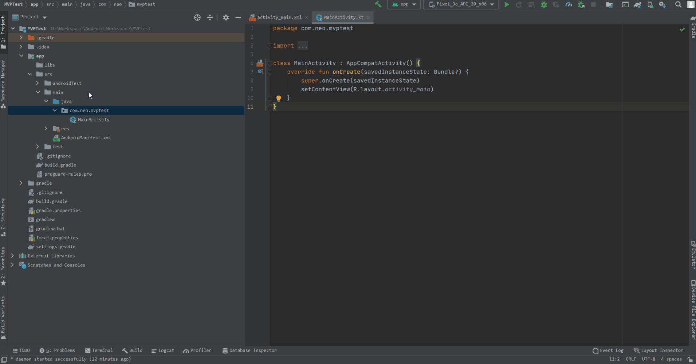

[TOC]
# Android MVP Template
### 序
> 今天是在项目的时候频繁创建mvp架构的类，突然想到之前用到的AndroidLiveTemplate模板，于是就想写一个模板一键创建，
于是乎就去安装目录下寻找相关的模板文件夹，找了半天发现原来的那套freemarker的那套模板引擎被和谐了，网上翻阅了资料才发现
从Android4.1开始，Android live template的方式已经被Google和谐了，最近刚好是项目有这个需要，所以从新整理一下官方文档，也参考了一些网友的总结，再结合我项目MVP的架构，写了一个插件

<!-- Plugin description -->
 这是一个AndroidStudio的插件，使用的是intellij官方开源的[intellij platform  plugin template](https://github.com/JetBrains/intellij-platform-plugin-template)
 我在这里就不对这个项目的结构以及详细的api进行讲解，如果有需要的小伙伴可以移步查询，本文档直接从项目源码进行改造成我们想要的template开始
<!-- Plugin description end -->

### 添加wizard-template.jar
 首先我们下载了intellij官方模板之后，我们首先在项目的根目录下创建一个lib目录，然后在AndroidStudio的安装目录下面找到wizard-template.jar,windows电脑该文件在**Android Studio\plugins\android\lib\\**
 目录下，MacOS系统的话在**Applications/Android Studio.app/Contents/plugins/android/lib/目录下**, 找到这个文件之后将其复制到新建的lib目录下面
 
### 修改build.gradle.kts
添加依赖

```
dependencies {
    detektPlugins("io.gitlab.arturbosch.detekt:detekt-formatting:1.17.1")
    compileOnly(files("lib/wizard-template.jar")) // 添加这一行
}
```

### 修改gradle.properties
这里我们需要修改的地方分别是如下四处

| 字段 | 是否必须要修改 | 原始值 | 修改后的值 |
| --- | --- | --- | --- |
| pluginGroup | x | org.jetbrains.plugins.template | com.neo.mvp.template |
| pluginName | x | IntelliJ Platform Plugin Template | MVP Template |
| platformVersion | x | 0.10.1 | 0.0.1 |
| platformPlugins | √ |  | Kotlin,com.intellij.java,org.jetbrains.android, android, org.jetbrains.kotlin |

这其中有三个不是必须要修改的，不该也不影响后续的开发，不多还是建议结合自己项目修改一下这些配置

### 修改setting.gradle.kts
```
rootProject.name = "MVP Template"
```

接下来对项目代码的编写，如果你修改了gradle.properties里的所pluginGroup属性的值，接下来你需要对
**src/main/kotlin/** 目录下的包路径修改成对应的包名

### 改造 ***listeners/MyProjectManagerListener.kt***
管理着项目的生命周期的监听
```kotlin

internal class MyProjectManagerListener : ProjectManagerListener {
    private var projectInstance: Project? = null
    override fun projectOpened(project: Project) {
        projectInstance = project
        project.getService(MyProjectService::class.java)
    }
    override fun projectClosing(project: Project) {
        projectInstance = null
        super.projectClosing(project)
    }
}

```

### 接下来在src/main/kotlin目录下创建other，其他包和文件的目录结构如下
```
├──src
├   └──main
├       └──kotlin
├            └──other
├                 └──mvp
├                     └──SimplePluginTemplateProviderImpl.kt
├                     └──activity
├                           └──res.layout
├                                     └──mvpActivityXml.kt
├                           └──src.app_package
├                                     └──contract
├                                        └──mvpContract.kt
├                                     └──p
├                                        └──mvpPresenter.kt
├                                     └──v
├                                        └──mvpActivity.kt
├                                     └──mvpBasePresenter.kt
├                                     └──mvpBaseView.kt
├                           └──mvpActivityRecipe.kt
├                           └──mvpActivityTemplate.kt


```
### 以Activity为例，为创建的文件注入灵魂
#### 实现 WizardTemplateProvider
> MVPTemplateProviderImpl.kt

```
package other.mvp

import com.android.tools.idea.wizard.template.Template
import com.android.tools.idea.wizard.template.WizardTemplateProvider
import other.mvp.activity.mvpActivityTemplate


/**
 *  @Author Neo
 *  @Date   2021/6/7
 *  @Env    Viicare-Neo
 *  @Description  SamplePluginTemplateProviderImpl
 */
class MVPTemplateProviderImpl: WizardTemplateProvider() {


    override fun getTemplates(): List<Template> {
        return listOf(
            // activity 模板
            mvpActivityTemplate
        )
    }
}
```

#### 为mvpActivityTemplate.kt 注入灵魂
> 这个文件是设置在创建Activity的时候，输入的信息，
  例如 ActivityName，layoutName, packageName

```kotlin
package other.mvp.activity

import com.android.tools.idea.wizard.template.*
import com.android.tools.idea.wizard.template.impl.activities.common.MIN_API


/**
 *  @Author Neo
 *  @Date   2021/6/7
 *  @Env    Viicare-Neo
 *  @Description  mvpActivityTemplate
 *  这个文件是设置在创建Activity的时候，输入的信息，
 *  例如 ActivityName，layoutName, packageName
 */
val mvpActivityTemplate
    get() = template {
        revision = 1
        name = "MVP Activity"
        description = "适用于MVP框架的Activity"
        minApi = MIN_API
        minBuildApi = MIN_API

        category = Category.Other
        formFactor = FormFactor.Mobile
        screens = listOf(WizardUiContext.ActivityGallery, WizardUiContext.MenuEntry, WizardUiContext.NewProject, WizardUiContext.NewModule)

        lateinit var layoutName: StringParameter

        val activityClass = stringParameter {
            name = "Activity Name"
            default = "Main"
            help = "只输入名字，不要包含Activity"
            constraints = listOf(Constraint.NONEMPTY)
        }

        layoutName = stringParameter {
            name = "Layout Name"
            default = "activity_main"
            help = "请输入布局的名字"
            constraints = listOf(Constraint.LAYOUT, Constraint.UNIQUE, Constraint.NONEMPTY)
            suggest = { activityToLayout(activityClass.value.toLowerCase()) }
        }

        val packageName = defaultPackageNameParameter

        widgets(
            TextFieldWidget(activityClass),
            TextFieldWidget(layoutName),
            PackageNameWidget(packageName)
        )
//        thumb { File("logo.png") }
        recipe = { data: TemplateData ->
            mvpActivityRecipe(
                data as ModuleTemplateData,
                activityClass.value,
                layoutName.value,
                packageName.value)
        }
    }

val defaultPackageNameParameter
    get() = stringParameter {
        name = "Package name"
        visible = { !isNewModule }
        default = "com.neo.myapp"
        constraints = listOf(Constraint.PACKAGE)
        suggest = { packageName }
    }
```

#### 为mvpActivityRecipe.kt 注入灵魂
> 这个类是处理按照模板创建项目文件并保存的,我们再创建other.mvp.*下面的文件路径是可以任意的，
> 实际创建的文件包路径都是在这个文件的save方法中决定
```kotlin
package other.mvp.activity

import com.android.tools.idea.wizard.template.ModuleTemplateData
import com.android.tools.idea.wizard.template.RecipeExecutor
import other.mvp.activity.res.layout.mvpActivityXml
import other.mvp.activity.src.app_package.contract.mvpContract
import other.mvp.activity.src.app_package.mvpBasePresenter
import other.mvp.activity.src.app_package.mvpBaseView
import other.mvp.activity.src.app_package.p.mvpPresenter
import other.mvp.activity.src.app_package.v.mvpActivityKt


/**
 *  @Author Neo
 *  @Date   2021/6/7
 *  @Env    Viicare-Neo
 *  @Description  mvpActivityRecipe 这个文件用于将创建的文件保存到文件夹中，例如Activity，布局文件等
 */
fun RecipeExecutor.mvpActivityRecipe(
    moduleData: ModuleTemplateData,
    activityClass: String,
    layoutName: String,
    packageName: String
) {

    val (projectData, srcOut, resOut) = moduleData
    val ktOrJavaExt = projectData.language.extension

    val mvpActivity = mvpActivityKt(packageName, activityClass, layoutName, packageName)
    // 保存Activity
    save(mvpActivity, srcOut.resolve("v/${activityClass}Activity.${ktOrJavaExt}"))
    // 保存xml
    save(mvpActivityXml(packageName, activityClass), resOut.resolve("layout/${layoutName}.xml"))

    try {
        // 判断BaseView类是否存在，如果不存在则创建保存
        val forName = Class.forName("${packageName}.BaseView")
    } catch (e: Exception) {
        save(mvpBaseView(packageName), srcOut.resolve("BaseView.${ktOrJavaExt}"))
    }

    try {
        // 判断BasePresenter类是否存在，如果不存在则创建保存
        val forName = Class.forName("${packageName}.BasePresenter")
    } catch (e: Exception) {
        save(mvpBasePresenter(packageName), srcOut.resolve("BasePresenter.${ktOrJavaExt}"))
    }

    // 保存Contract
    save(mvpContract(packageName,activityClass), srcOut.resolve("contract/${activityClass}Contract.${ktOrJavaExt}"))
    // 保存Presenter
    save(mvpPresenter(packageName,packageName,activityClass), srcOut.resolve("p/${activityClass}Presenter.${ktOrJavaExt}"))
}
```
#### 为mvpBaseView.kt注入灵魂
> 这个是我项目中mvp架构的view底层类
```kotlin
package other.mvp.activity.src.app_package


/**
 *  @Author Neo
 *  @Date   2021/6/8
 *  @Env    Viicare-Neo
 *  @Description  mvpBaseView
 */
fun mvpBaseView(
    packageName: String
) = """
package $packageName

interface BaseView<P> {
     fun setPresenter(p:P)
}
    
"""
```

#### 为mvpBasePresenter.kt注入灵魂
> 这个是我项目中mvp架构的presenter底层类
```kotlin
package other.mvp.activity.src.app_package
/**
 *  @Author Neo
 *  @Date   2021/6/8
 *  @Env    Viicare-Neo
 *  @Description  mvpBasePresenter
 */
fun mvpBasePresenter(
    packageName:String
)="""
package $packageName

interface BasePresenter {

    fun subscribe()

    fun unSubscribe()
}
"""
```
#### 为mvpContract.kt注入灵魂
> 这个是我项目mvp架构中针对不同activity进行注册v,p两层处理方法的接口
```kotlin
package other.mvp.activity.src.app_package.contract


/**
 *  @Author Neo
 *  @Date   2021/6/8
 *  @Env    Viicare-Neo
 *  @Description  mvpContract
 */

fun mvpContract(
    packageName:String,
    activityName:String
)="""
package $packageName.contract

import ${packageName}.BaseView
import ${packageName}.BasePresenter

interface ${activityName}Contract {
    interface View: BaseView<Presenter> {
        
    }
    
    interface Presenter: BasePresenter {
        
    }
}
    
"""
```

#### 为mvpPresenter.kt注入灵魂
> 这个是我项目mvp架构中针对不同activity进行P端代码的具体实现类
```kotlin
package other.mvp.activity.src.app_package.p


/**
 *  @Author Neo
 *  @Date   2021/6/8
 *  @Env    Viicare-Neo
 *  @Description  mvpPresenter
 */

fun mvpPresenter (
    applicationPackage: String?,
    packageName:String,
    activityClass: String
)="""
package $packageName.p

import ${applicationPackage}.contract.${activityClass}Contract
class ${activityClass}Presenter(private val mView: ${activityClass}Contract.View): ${activityClass}Contract.Presenter {
    init {
        // TODO something
        mView.setPresenter(this)
    }
    
    override fun subscribe() {
    
    }
    
    override fun unSubscribe() {
    
    }
} 

"""
```


#### 为mvpActivity.kt注入灵魂
> 这个是我项目中页面activity
```kotlin
package other.mvp.activity.src.app_package.v


/**
 *  @Author Neo
 *  @Date   2021/6/7
 *  @Env    Viicare-Neo
 *  @Description  mvpActivityKt
 */
fun mvpActivityKt (
    applicationPackage: String?,
    activityClass: String,
    layoutName: String,
    packageName: String
)="""
package $packageName.v

import android.os.Bundle
import androidx.appcompat.app.AppCompatActivity
import ${applicationPackage}.p.${activityClass}Presenter
import ${applicationPackage}.contract.${activityClass}Contract

class ${activityClass}Activity : AppCompatActivity (),${activityClass}Contract.View {

    private lateinit var mPresenter: ${activityClass}Contract.Presenter
    
    override fun onCreate(savedInstanceState: Bundle?) {
        super.onCreate(savedInstanceState)
        setContentView(R.layout.${layoutName})
        
        // TODO something
        ${activityClass}Presenter(this)
    }

    override fun setPresenter (p: ${activityClass}Contract.Presenter) {
        this.mPresenter = p
        this.mPresenter.subscribe()
    }
}
"""

```
#### 接下来就是为布局文件layout注入灵魂
> 决定此布局文件的类是res/layout/mvpActivityXml.kt
```kotlin
package other.mvp.activity.res.layout


/**
 *  @Author Neo
 *  @Date   2021/6/7
 *  @Env    Viicare-Neo
 *  @Description  mvpActivityXml
 */
fun mvpActivityXml(packageName: String,
                   activityClass: String
)="""
<?xml version="1.0" encoding="utf-8"?>
<androidx.constraintlayout.widget.ConstraintLayout 
    xmlns:android="http://schemas.android.com/apk/res/android"
    xmlns:app="http://schemas.android.com/apk/res-auto"
    xmlns:tools="http://schemas.android.com/tools"
    android:layout_width="match_parent"
    android:layout_height="match_parent"
    android:padding="19dp"
    tools:context="${packageName}.v.${activityClass}Activity"
    >
    
</androidx.constraintlayout.widget.ConstraintLayout>   
"""
```
莫着急，还有最后一步
#### 修改 src/main/resources/META-INF/plugin.xml
* 首先必须添加依赖
```
  <depends>org.jetbrains.android</depends>
  <depends>org.jetbrains.kotlin</depends>
  <depends>com.intellij.modules.java</depends>
```
* 如果你在之前步骤中修改了报名，这还需要根据自己的需求进行<id><name><vendor>等值的修改
* 接下来还需要替换我们创建的 **applicationService**、 **projectService**
* 修改<applicationListener>/<listener class="">的值为我们之前创建的监听项目生命周期的listener文件的路径
* 最后添加<wizardTemplateProvider />的值为我们创建的MVPTemplateProviderImpl
直接上代码
```xml
<idea-plugin>
    <id>com.neo.mvp.template</id>
    <name>MVP Template</name>
    <description>使用该模板创建基于MVP的Activity,layout,presenter,contract等文件</description>
    <vendor>Neo</vendor>

    <!-- Product and plugin compatibility requirements -->
    <!-- https://plugins.jetbrains.com/docs/intellij/plugin-compatibility.html -->
    <depends>com.intellij.modules.platform</depends>
    <depends>org.jetbrains.android</depends>
    <depends>org.jetbrains.kotlin</depends>
    <depends>com.intellij.modules.java</depends>

    <extensions defaultExtensionNs="com.intellij">
        <applicationService serviceImplementation="com.neo.mvp.template.services.MyApplicationService"/>
        <projectService serviceImplementation="com.neo.mvp.template.services.MyProjectService"/>
    </extensions>

    <applicationListeners>
        <listener class="com.neo.mvp.template.listeners.MyProjectManagerListener"
                  topic="com.intellij.openapi.project.ProjectManagerListener"/>
    </applicationListeners>

    <extensions defaultExtensionNs="com.android.tools.idea.wizard.template">
        <wizardTemplateProvider implementation="other.mvp.MVPTemplateProviderImpl"/>
    </extensions>
</idea-plugin>

```

Well,Well!
插件至此就算是开发完成了，接下来运行 Run Plugin，执行成功会在/build/libs/ 目录下生成我们想要的jar ，
将此jar安装到AndroidStudio Plugin中即可，
New->Other->xxx 效果如下图


### 遗留问题
* 目前创建Activity之后还没有完成对其在Manifest.xml中的注册，需要开发者手动自行注册，这个问题下个版本中完成

